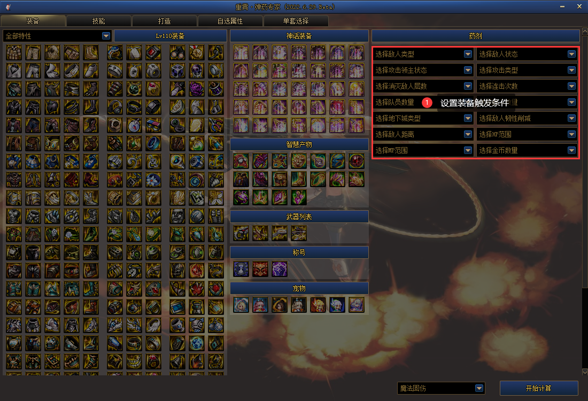
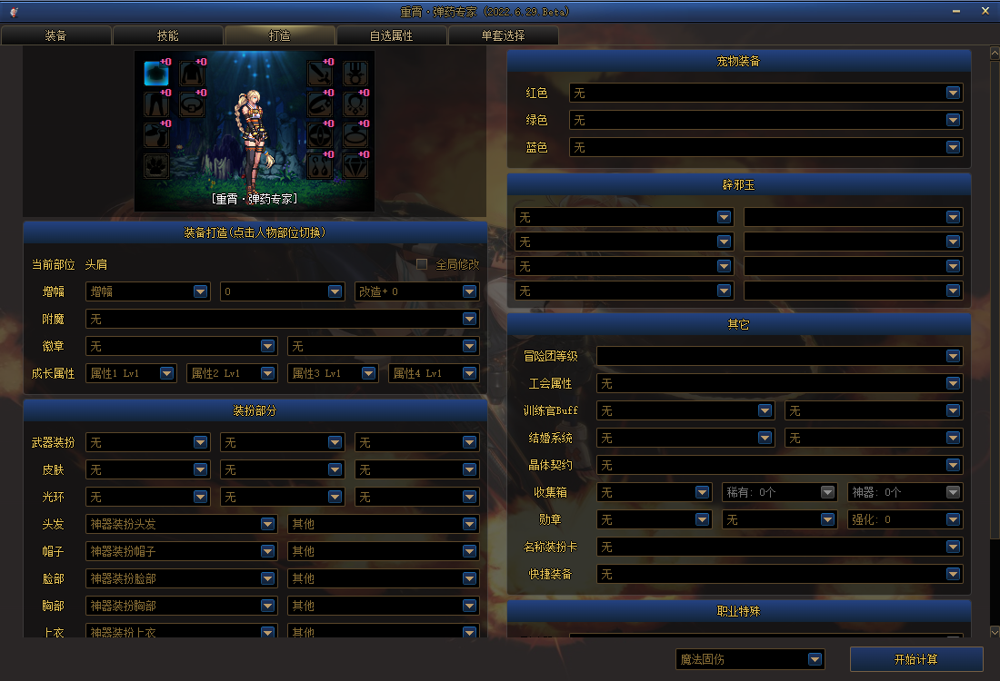

## 软件简介

本软件为 DNF 相关的计算器，供玩家进行搭配装备及伤害计算等各方面使用  目前职业还在陆续添加中，预计一周 2~3 个职业

## 开始使用

<strong>下载路径</strong>: https://wwn.lanzout.com/s/dcalc 

 

下载网盘中最新程序`DNF计算器_XX.XX_.exe`并完成安装 

- exe：安装包，多次使用会删除老的存档
- 绿色版：免安装版本，解压到目录下后，打开`DNF计算器.exe`即可，覆盖不会删除存档
- 更新包：计算器的更新文件，可手动下载后覆盖计算器下的`resources`文件夹

## 更新

### 自动更新

 

 

计算器在每次打开的时候会自动检测是否有版本更新，确认后将进行自动更新，更新完毕点击完成会自动重启计算器

### 手动更新

如自动更新报错或想要手动更新，有如下两种方式手动更新，且存档不会丢失：

- 关闭计算器后，手动下载网盘中更新包`resources.zip`，手动解压覆盖如下目录   
- 关闭计算器后，手动下载网盘中绿色版，直接覆盖

## 装备

 该页面目前还在开发中，目前可以进行装备条件设置  后续会添加多选计算、药剂选择、军团融合装备等 

!> 装备条件未进行预设，一定要对装备条件进行选择 

## 技能

 该页面下可设置计算技能相关：技能等级、技能次数、技能形态、护石、符文 

### 技能队列说明

 在选择技能次数后，会自动添加技能到队列中，部分右上角有文字的技能可点击图标进行形态切换，技能图标可长按拖拽进行队列位置变更 

!> 技能次数未预设，请自行选择，否则计算将无结果 

## 打造

点击对应的部位，可切换部位进行打造修改  右上角可进行全局修改勾选，可全部部位一起设置增幅、成长属性，同类型可一直设置附魔、徽章

## 自选属性

在单套选择/装备内选择自定义装备后，可在此进行自定义装备属性的选择

## 单套选择

